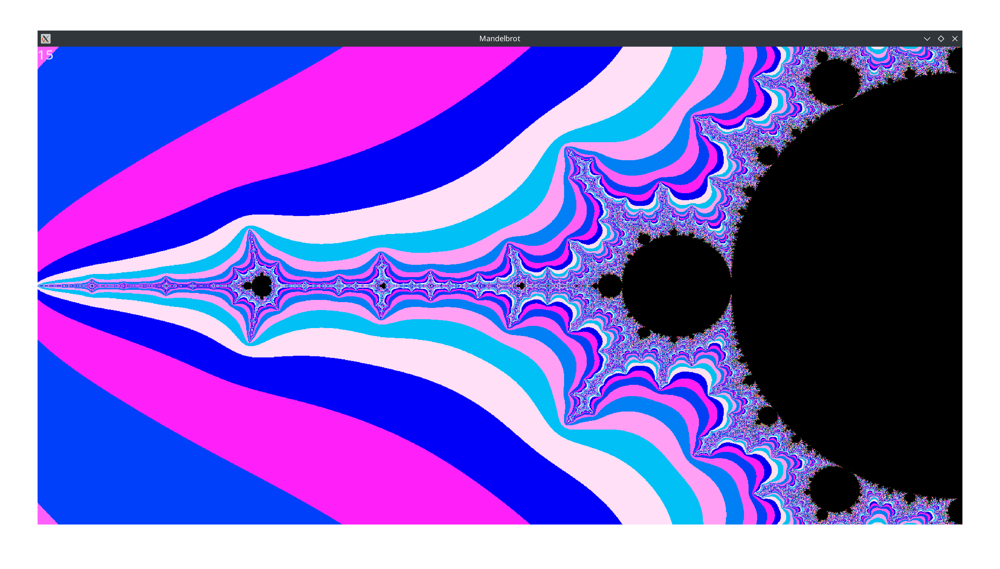
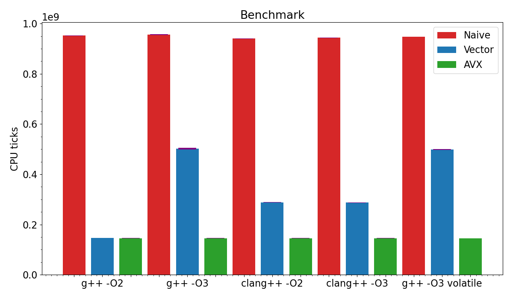
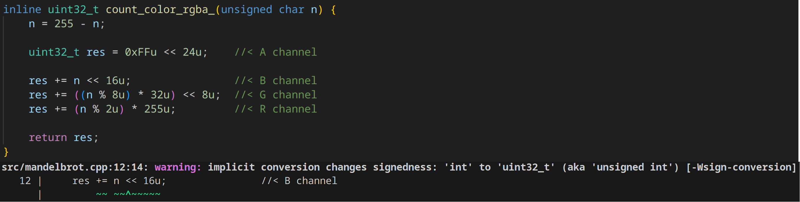

# Содержание

1. [Множество Мандельброта](#множество-мандельброта)
    1. [Программа](#программа)
        1. [Режимы](#режимы)
        2. [Реализации алгоритма](#реализации-алгоритма)
        3. [Графический режим](#графический-режим)
    2. [Измерение производительности](#измерение-производительности)
        1. [Методика измерений](#методика-измерений)
            1. [Параметры программы](#параметры-программы)
        2. [Концигурации, для которых производилось измерение](#концигурации,-для-которых-производилось-измерение)
        3. [Результаты](#результаты)
        4. [Характерное время работы программы](#характерное-время-работы-программы)
        5. [Средние значения количества тактов процессора на 1 кадр](#средние-значения-количества-тактов-процессора-на-1-кадр)
        6. [Итоги](#итоги)
    3. [Зависимости программы](#зависимости-программы)
2. [Источники и инструменты](#источники-и-инструменты)
3. [Благодарности](#благодарности)

# Множество Мандельброта

Множество Мандельброта строится таким образом:

1. Цвет пикселя изображения зависит от числа `N`.
2. Число `N` - это количество шагов, за которое точка `Z` выйдет за пределы окружности. Если точка не выходит за `N = 255` шагов, то обход останавливается
3. Координаты точки `Z` рассчитываются по формулам (`x[0]`, `y[0]` координаты рассчитываемого пикселя):
    - `x[i] = x[i - 1]^2 - y[i - 1]^2 + x[0]`
    - `y[i] = 2 * x[i - 1] * y[i - 1] + y[0]`
4. Библиотека `SFML` задаёт цвет пикселя в формате `rgba`. Рассчётные формулы в моей программе:

| R | G | B | A |
|:-:|:-:|:-:|:-:|
| `255 - N` | `((255 - N) % 8) * 32` | `((255 - N) % 2) * 255` | `0xFF` |

Таким образом, можно легко отследить области, в которых точка не вышла за пределы окружности - они чёрного цвета.

## Программа

### Режимы
1. Вывод изображения. В левом верхнем углу окна выводится количество кадров в секунду
2. Тестирование. Программа рассчитывает 100 кадров и выводит количество затраченных тактов процессора (`rdtsc`)

### Реализации алгоритма

1. Простая (`Naive`) - расчёт отдельно для каждого пикселя
2. Векторизация (`Vector`) - облегчение оптимизации для компилятора - рассчёт ведётся массивами по 8 пикселей в ряд:
    - например, `float dist2 = x2 + y2;` => `float dist2[8] = {}; for (int i = 0; i < 8; i++) dist2[i] = x2[i] + y2[i];`
3. Векторизация с `AVX` (`AVX`) - рассчёт массивами по 8 пикселей с использованием `SIMD` интринсиков

В скобках указаны краткие названия, которые будут использоваться в таблицах и графиках

### Графический режим

В графическом режиме есть возможность управления изображением при помощи клавиатуры:
- стрелки - двигать изображение
- `+`/`-` - изменять масштаб

## Измерение производительности

- Компиляторы:
    - `g++ (GCC) 13.2.1 20230801`
    - `clang++ (clang) 17.0.6`
- Уровни оптимизации: `O2`, `O3`
- [Полный список флагов](results.md#список-флагов)
- Процессор: `Intel(R) Core(TM) i7-6700HQ CPU @ 2.60GHz SkyLake`
- ОС: `Arch Linux`, Kernel: `6.6.22-1-lts (64-bit)`
- Стабилизировавшиеся на время измерений параметры процессора:
    - Температура: `68°C`
    - Частота: `(3200 ± 100) MHz`

### Методика измерений

#### Параметры программы
- Размер изображения: `900*1600` пикселей
- Количество кадров на 1 запуск: `100`
- Радиус окружности, при выходе за пределы которой считается, что точка ушла на бесконечность: `100` пикселей
- Максимальное число итераций для одной точки: `256`

Программа запрашивает количество тактов командой ассемблера `rdtsc`. Затем производится расчёт 100 кадров. После ещё раз вызывается команда `rdtsc`. Разность количества тактов делится на число кадров (100) и выводится в стандартный вывод.

При помощи `python` скрипта программа запускается по 8 раз для каждой реализации алгоритма

### Концигурации, для которых производилось измерение

1. `g++ -O2` - компилятор `gcc`, уровень оптимизации `O2`
2. `g++ -O3` - компилятор `gcc`, уровень оптимизации `O3`
3. `clang++ -O3` - компилятор `clang`, уровень оптимизации `O2`
4. `clang++ -O3` - компилятор `clang`, уровень оптимизации `O3`
5. `g++ -O3 volatile` - компилятор `gcc`, уровень оптимизации `O3`. Запись цвета пикселя в массив заменена на присвоение глобальной `volatile` переменной (режим включается при помощи определения макроса `VOLATILE`)

### Результаты

Полные [результаты в таблице](results.md#результаты-измерений)

### Характерное время работы программы

Время выполнения всей программы (расчёт 100 кадров) в секундах (`python time.time()`)

|   | Naive | Vector no AVX | Vector AVX |
|---|:-----:|:-------------:|:----------:|
| `g++ -O2` | 36.8 | 5.8 | 5.7 |
| `g++ -O3` | 37.0 | 19.5 | 5.7 |
| `clang++ -O2` | 36.4 | 11.2 | 5.7 |
| `clang++ -O3` | 36.5 | 11.2 | 5.7 |
| `g++ -O3 volatile` | 36.7 | 19.3 | 5.7 |

Временем стабилизации параметров процессора в начале можно пренебречь по сравнению с временем исполнения всей программы

### Средние значения количества тактов процессора на 1 кадр

|   | Naive * 1e5 | Vector no AVX * 1e5 | Vector AVX * 1e5 |
|---|:-----:|:-------------:|:----------:|
| `g++ -O2` | 9520 ± 5 | 1466 ± 4 | 1455 ± 6 |
| `g++ -O3` | 9560 ± 10 | 5022 ± 27 | 1456 ± 3 |
| `clang++ -O2` | 9406 ± 8 | 2887 ± 13 | 1455 ± 4 |
| `clang++ -O3` | 9436 ± 9 | 2876 ± 10 | 1458 ± 3 |
| `g++ -O3 volatile` | 9474 ± 5 | 4982 ± 15 | 1450 ± 2 |

### Итоги

Полная [таблица сранений](results.md#полная-таблица-сравнения)

1. Простая реализация:
    - время исполнения почти не зависит от компилятора и режима оптимизации
2. Реализация с `AVX` инструкциями:
    - так же одинаково производительна
3. Векторизация без `AVX` инструкций:
    - `g++ -O2` смог определить, что можно использовать `AVX` инструкции и заменил циклы на них (вывод godbolt на рисунке 2)
    - `g++ -O3` оказался самым медленным
    - `clang++ -O2` и `clang++ -O3` почти одинаковы. Они не использовали `AVX`, но смогли произвести оптимизации лучше, чем `g++ -O3`

Результат `g++ -O3 volatile` не отличается от `g++ -O3`. Дополнительно производились замеры при помощи `cachegrind`. Количество кэш-миссов почти одинаково для обоих вариантов. Можно сказать, что массив пикселей параллельно загружается в кеш и запись в него не задерживает программу.

Также отметим, что предупреждения `clang` помогли исправить ошибку в битовой арифметике, приводившую к неопределённому поведению при компиляции с `g++ -O2`. Для этого же исходного кода `gcc` не выдавал никаких ошибок и предупреждений.

## Зависимости программы

1. [SFML](https://www.sfml-dev.org/)
2. x86-64 + AVX, AVX2

# Источники и инструменты

1. **Computer Systems: A Programmer's Perspective** 3rd Edition by **Randal Bryant**, **David O'Hallaron**
2. **Compiler explorer** - [godbolt.com](https://godbolt.com)
3. **Mirror of Intel Intrinsics Guide** - [laurence.com/sse](https://www.laruence.com/sse/)
4. **Jupyter Notebook** - [jupyter.org](https://jupyter.org/)
5. **Python Matplotlib** - [matplotlib.org](https://matplotlib.org/)
6. **CPU-X** - [https://github.com/TheTumultuousUnicornOfDarkness/CPU-X](https://github.com/TheTumultuousUnicornOfDarkness/CPU-X/wiki)

# Благодарности
- [Ilya Dedinsky](https://github.com/ded32) aka Ded as prepod
- [Aleksei Durnov](https://github.com/Panterrich) as mentor
